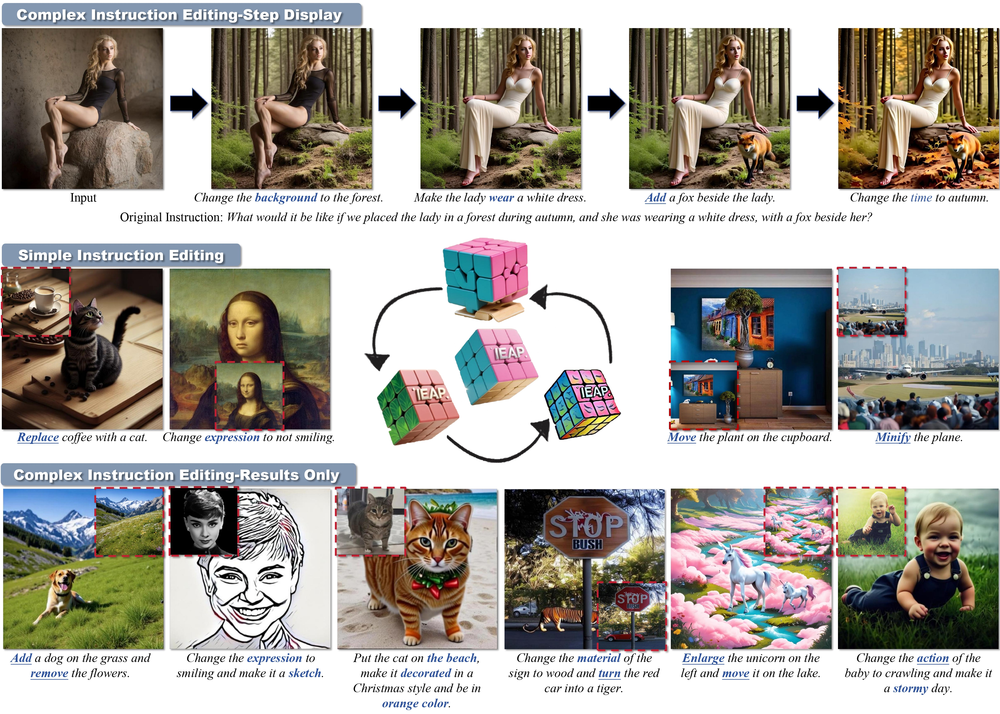
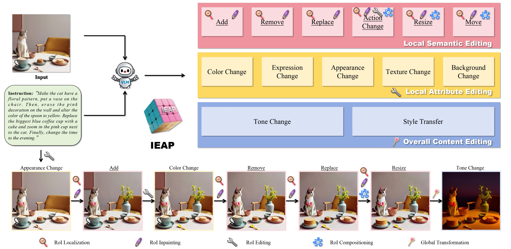

# Image Editing As Programs with Diffusion Models

<br>

> **Image Editing As Programs with Diffusion Models**
> <br>
> Yujia Hu, 
> [Songhua Liu](http://121.37.94.87/), 
> ZhenXiong Tan,
> [Xingyi Yang](https://adamdad.github.io/), 
> and 
> [Xinchao Wang](https://sites.google.com/site/sitexinchaowang/)
> <br>
> [xML Lab](https://sites.google.com/view/xml-nus), National University of Singapore
> <br>




<center>
  We propose <strong>IEAP</strong>! IEAP is an image editing framework that decomposes complex instructions into composable atomic operations, enabling high-precision handling of both structurally consistent and inconsistent edits, as well as compositional multi-step instructions.
</center>

<strong>Pipeline:</strong>


## 🔧 Installation
1. First install python and pytorch:
```bash
conda create -n ieap python=3.10
conda activate ieap
conda install pytorch==2.3.1 torchvision==0.18.1 pytorch-cuda=12.1 cuda -c pytorch  -c "nvidia/label/cuda-12.1.0" -c "nvidia/label/cuda-12.1.1"
```
2. Install other dependencies:
```bash
pip install -r requirements.txt
```

## 🖼️ Run
Start with:

```bash
python main.py image_path editing_instructions
```
For example:
```bash
python main.py "assets/a12.jpg" "Change the action of the woman to running and minify the woman."
```

If you have already had a json file for editing:
```bash
python main_json.py image_path json_path
```
For example:
```bash
python main_json.py "assets/a12.jpg" "instructions.json"
```

## 🔗 Related Projects
We sincerely thank the excellent open-source projects: [OminiControl](https://github.com/Yuanshi9815/OminiControl.git) and [Sa2VA](https://github.com/magic-research/Sa2VA.git).
